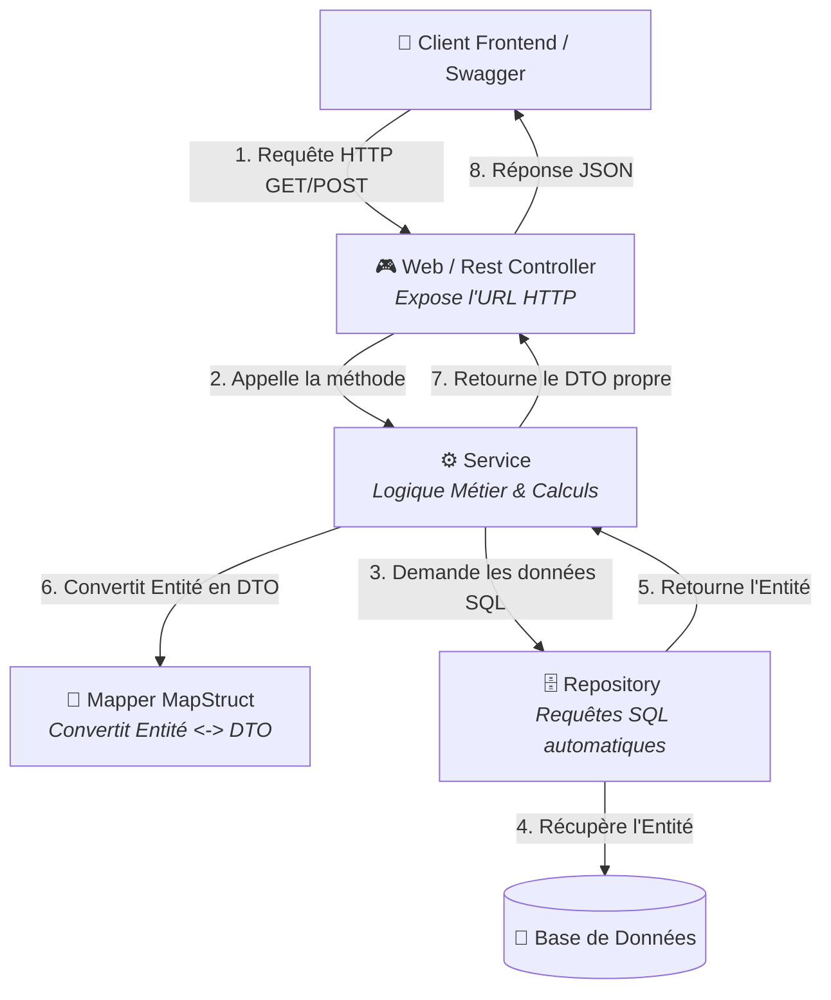
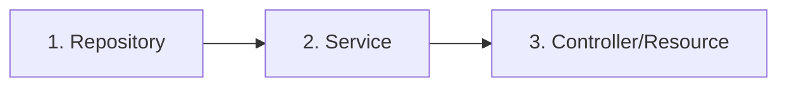

# Guide Complet : Création d'un Endpoint dans api-dove 🚀

Ce guide vous explique de manière simple, claire et pas-à-pas comment créer un **endpoint REST** (une URL d'API) dans le backend de votre application **api-dove**. Il est conçu pour qu'un débutant puisse comprendre et reproduire le processus complet de bout en bout sans avoir à demander ou chercher ailleurs.

---

## 📐 L'Architecture en Couches (Le Flux de Données)

Dans une application Spring Boot (générée avec JHipster), le code est organisé en **couches**. Chaque couche a un rôle précis. 

Voici le chemin que parcourt une requête HTTP envoyée par le frontend (comme `DoveFront`) vers le backend :



---

## 📂 Où se trouvent les fichiers dans `src/main/java` ?

Tous les fichiers Java se trouvent dans le répertoire : 
[`src/main/java/sn/dove/backend/`](file:///c:/Users/Madibo%20Ka/Documents/dove/api-dove/src/main/java/sn/dove/backend/)

Voici la structure des dossiers que vous allez manipuler :

*   [`domain/`](file:///c:/Users/Madibo%20Ka/Documents/dove/api-dove/src/main/java/sn/dove/backend/domain/) : Contient les **Entités JPA**. Ce sont les classes Java qui représentent directement les tables de la base de données.
*   [`repository/`](file:///c:/Users/Madibo%20Ka/Documents/dove/api-dove/src/main/java/sn/dove/backend/repository/) : Contient les **Repositories**. Ce sont des interfaces Spring Data JPA qui permettent d'interagir avec la base de données (faire des SELECT, INSERT, UPDATE, DELETE).
*   [`service/dto/`](file:///c:/Users/Madibo%20Ka/Documents/dove/api-dove/src/main/java/sn/dove/backend/service/dto/) : Contient les **DTO (Data Transfer Objects)**. Ce sont les objets qui sont envoyés/reçus par le frontend. Ils permettent de masquer les détails internes de la base de données.
*   [`service/mapper/`](file:///c:/Users/Madibo%20Ka/Documents/dove/api-dove/src/main/java/sn/dove/backend/service/mapper/) : Contient les **Mappers (MapStruct)**. Ils copient automatiquement les données d'une Entité vers un DTO, et vice-versa.
*   [`service/`](file:///c:/Users/Madibo%20Ka/Documents/dove/api-dove/src/main/java/sn/dove/backend/service/) : Contient les **Services**. C'est ici que l'on écrit les calculs, les vérifications de sécurité, les validations, etc.
*   [`web/rest/`](file:///c:/Users/Madibo%20Ka/Documents/dove/api-dove/src/main/java/sn/dove/backend/web/rest/) : Contient les **REST Controllers (appelés Resources)**. C'est ici qu'on définit les routes de notre API (ex: `@GetMapping("/api/utilisateurs")`).

---

## 🛠️ Cas Pratique 1 : Créer un tout nouvel Endpoint à partir de zéro

Imaginons que nous voulons créer un endpoint complet pour gérer des **Produits** (`Produit`). 
Voici les **6 étapes incontournables** :

### Étape 1 : Créer la table dans la Base de Données (L'Entité)
Créez un fichier [`Produit.java`](file:///c:/Users/Madibo%20Ka/Documents/dove/api-dove/src/main/java/sn/dove/backend/domain/Produit.java) dans le dossier `domain/` :

```java
package sn.dove.backend.domain;

import jakarta.persistence.*;
import jakarta.validation.constraints.NotNull;
import java.io.Serializable;
import java.util.UUID;

@Entity
@Table(name = "produits") // Nom de la table SQL
public class Produit implements Serializable {

    @Id
    @GeneratedValue // Génère l'ID automatiquement
    @Column(name = "id")
    private UUID id;

    @NotNull
    @Column(name = "nom", nullable = false)
    private String nom;

    @Column(name = "prix")
    private Double prix;

    // --- GETTERS ET SETTERS ---
    public UUID getId() { return id; }
    public void setId(UUID id) { this.id = id; }

    public String getNom() { return nom; }
    public void setNom(String nom) { this.nom = nom; }

    public Double getPrix() { return prix; }
    public void setPrix(Double prix) { this.prix = prix; }
}
```

> [!NOTE]
> Les annotations `@Entity` et `@Table` indiquent à Hibernate (le framework ORM) que cette classe correspond à une table dans la base de données.

---

### Étape 2 : Créer le Repository
Créez une interface [`ProduitRepository.java`](file:///c:/Users/Madibo%20Ka/Documents/dove/api-dove/src/main/java/sn/dove/backend/repository/ProduitRepository.java) dans le dossier `repository/` :

```java
package sn.dove.backend.repository;

import java.util.UUID;
import org.springframework.data.jpa.repository.JpaRepository;
import org.springframework.stereotype.Repository;
import sn.dove.backend.domain.Produit;

@Repository
public interface ProduitRepository extends JpaRepository<Produit, UUID> {
    // Spring génère automatiquement toutes les requêtes de base (findById, save, delete, etc.) !
}
```

---

### Étape 3 : Créer le DTO (Data Transfer Object)
Il ne faut jamais renvoyer directement une entité de base de données à votre utilisateur frontend pour des raisons de sécurité et de découplage.
Créez un fichier [`ProduitDTO.java`](file:///c:/Users/Madibo%20Ka/Documents/dove/api-dove/src/main/java/sn/dove/backend/service/dto/ProduitDTO.java) dans le dossier `service/dto/` :

```java
package sn.dove.backend.service.dto;

import java.io.Serializable;
import java.util.UUID;
import jakarta.validation.constraints.NotNull;

public class ProduitDTO implements Serializable {

    private UUID id;

    @NotNull
    private String nom;

    private Double prix;

    // --- GETTERS ET SETTERS ---
    public UUID getId() { return id; }
    public void setId(UUID id) { this.id = id; }

    public String getNom() { return nom; }
    public void setNom(String nom) { this.nom = nom; }

    public Double getPrix() { return prix; }
    public void setPrix(Double prix) { this.prix = prix; }
}
```

---

### Étape 4 : Créer le Mapper
Pour copier les propriétés de `Produit` vers `ProduitDTO` sans écrire 50 lignes de code, on utilise MapStruct.
Créez une interface [`ProduitMapper.java`](file:///c:/Users/Madibo%20Ka/Documents/dove/api-dove/src/main/java/sn/dove/backend/service/mapper/ProduitMapper.java) dans le dossier `service/mapper/` :

```java
package sn.dove.backend.service.mapper;

import org.mapstruct.Mapper;
import sn.dove.backend.domain.Produit;
import sn.dove.backend.service.dto.ProduitDTO;

@Mapper(componentModel = "spring")
public interface ProduitMapper extends EntityMapper<ProduitDTO, Produit> {
    // MapStruct génère automatiquement le code de conversion toDto() et toEntity() !
}
```

---

### Étape 5 : Créer le Service
C'est ici qu'on écrit la logique métier.
Créez une classe [`ProduitService.java`](file:///c:/Users/Madibo%20Ka/Documents/dove/api-dove/src/main/java/sn/dove/backend/service/ProduitService.java) dans le dossier `service/` :

```java
package sn.dove.backend.service;

import java.util.Optional;
import java.util.UUID;
import org.slf4j.Logger;
import org.slf4j.LoggerFactory;
import org.springframework.stereotype.Service;
import org.springframework.transaction.annotation.Transactional;
import sn.dove.backend.domain.Produit;
import sn.dove.backend.repository.ProduitRepository;
import sn.dove.backend.service.dto.ProduitDTO;
import sn.dove.backend.service.mapper.ProduitMapper;

@Service
@Transactional
public class ProduitService {

    private static final Logger LOG = LoggerFactory.getLogger(ProduitService.class);

    private final ProduitRepository produitRepository;
    private final ProduitMapper produitMapper;

    // Injection de dépendances par constructeur
    public ProduitService(ProduitRepository produitRepository, ProduitMapper produitMapper) {
        this.produitRepository = produitRepository;
        this.produitMapper = produitMapper;
    }

    // Récupérer un produit par son ID
    @Transactional(readOnly = true)
    public Optional<ProduitDTO> findOne(UUID id) {
        LOG.debug("Request to get Produit : {}", id);
        return produitRepository.findById(id)
            .map(produitMapper::toDto); // Convertit automatiquement l'entité en DTO
    }

    // Créer ou sauvegarder un produit
    public ProduitDTO save(ProduitDTO produitDTO) {
        LOG.debug("Request to save Produit : {}", produitDTO);
        Produit produit = produitMapper.toEntity(produitDTO); // Convertit le DTO reçu en entité BDD
        produit = produitRepository.save(produit);           // Sauvegarde en BDD
        return produitMapper.toDto(produit);                 // Renvoie le DTO mis à jour
    }
}
```

---

### Étape 6 : Créer le REST Controller (La Resource)
C'est la porte d'entrée de votre API, elle expose les URLs HTTP.
Créez une classe [`ProduitResource.java`](file:///c:/Users/Madibo%20Ka/Documents/dove/api-dove/src/main/java/sn/dove/backend/web/rest/ProduitResource.java) dans le dossier `web/rest/` :

```java
package sn.dove.backend.web.rest;

import java.net.URI;
import java.net.URISyntaxException;
import java.util.Optional;
import java.util.UUID;
import org.slf4j.Logger;
import org.slf4j.LoggerFactory;
import org.springframework.http.ResponseEntity;
import org.springframework.web.bind.annotation.*;
import sn.dove.backend.service.ProduitService;
import sn.dove.backend.service.dto.ProduitDTO;
import tech.jhipster.web.util.ResponseUtil;

@RestController
@RequestMapping("/api") // Préfixe pour toutes les routes de cette classe
public class ProduitResource {

    private static final Logger LOG = LoggerFactory.getLogger(ProduitResource.class);

    private final ProduitService produitService;

    public ProduitResource(ProduitService produitService) {
        this.produitService = produitService;
    }

    /**
     * GET /api/produits/{id} : Récupérer un produit par son ID.
     */
    @GetMapping("/produits/{id}")
    public ResponseEntity<ProduitDTO> getProduit(@PathVariable("id") UUID id) {
        LOG.debug("REST request to get Produit : {}", id);
        Optional<ProduitDTO> produitDTO = produitService.findOne(id);
        
        // ResponseUtil.wrapOrNotFound renvoie un statut 200 OK si le produit existe,
        // ou un statut 404 NOT FOUND s'il est absent.
        return ResponseUtil.wrapOrNotFound(produitDTO);
    }

    /**
     * POST /api/produits : Créer un nouveau produit.
     */
    @PostMapping("/produits")
    public ResponseEntity<ProduitDTO> createProduit(@RequestBody ProduitDTO produitDTO) throws URISyntaxException {
        LOG.debug("REST request to save Produit : {}", produitDTO);
        ProduitDTO result = produitService.save(produitDTO);
        return ResponseEntity.created(new URI("/api/produits/" + result.getId()))
            .body(result);
    }
}
```

---

## 🔄 Cas Pratique 2 : Ajouter un endpoint personnalisé à une entité existante (ex : `Utilisateur`)

Souvent, l'entité existe déjà (comme `Utilisateur`) et vous souhaitez juste rajouter une nouvelle URL personnalisée, par exemple :
👉 Trouver un utilisateur par son **adresse email**.

Voici le chemin à suivre dans ce cas :



### Étape A : Ajouter la requête dans le Repository
Ouvrez [`UtilisateurRepository.java`](file:///c:/Users/Madibo%20Ka/Documents/dove/api-dove/src/main/java/sn/dove/backend/repository/UtilisateurRepository.java) et rajoutez la méthode :

```java
import java.util.Optional;
// ...

public interface UtilisateurRepository extends JpaRepository<Utilisateur, UUID>, JpaSpecificationExecutor<Utilisateur> {
    
    // Spring Data JPA va analyser le nom de cette méthode "findByEmail" 
    // et va générer automatiquement la requête SQL : "SELECT * FROM utilisateurs WHERE email = ?"
    Optional<Utilisateur> findByEmail(String email);
}
```

### Étape B : Ajouter la logique dans le Service
Ouvrez [`UtilisateurService.java`](file:///c:/Users/Madibo%20Ka/Documents/dove/api-dove/src/main/java/sn/dove/backend/service/UtilisateurService.java) et rajoutez la méthode de récupération et conversion en DTO :

```java
@Transactional(readOnly = true)
public Optional<UtilisateurDTO> findByEmail(String email) {
    LOG.debug("Request to get Utilisateur by email : {}", email);
    return utilisateurRepository.findByEmail(email)
        .map(utilisateurMapper::toDto); // Convertit en DTO
}
```

### Étape C : Créer le Endpoint dans le Controller (Resource)
Ouvrez [`UtilisateurResource.java`](file:///c:/Users/Madibo%20Ka/Documents/dove/api-dove/src/main/java/sn/dove/backend/web/rest/UtilisateurResource.java) et rajoutez votre route HTTP :

```java
/**
 * GET  /utilisateurs/by-email/{email} : Récupérer un utilisateur par son email.
 */
@GetMapping("/utilisateurs/by-email/{email}")
public ResponseEntity<UtilisateurDTO> getUtilisateurByEmail(@PathVariable("email") String email) {
    LOG.debug("REST request to get Utilisateur by email : {}", email);
    Optional<UtilisateurDTO> utilisateurDTO = utilisateurService.findByEmail(email);
    
    // Si trouvé -> Status 200 OK + JSON
    // Si absent -> Status 404 NOT FOUND
    return ResponseUtil.wrapOrNotFound(utilisateurDTO);
}
```

---

## 🚦 Comment tester votre nouvel Endpoint ?

### 1. Démarrer le projet en local
Dans votre terminal (à la racine du dossier `api-dove`), lancez la commande suivante :
```bash
./mvnw
```
*(ou utilisez le bouton "Run" de votre IDE sur la classe `DoveBackendApp.java`)*.

### 2. Tester avec Swagger UI (Documentation Interactive)
Une fois le backend lancé, allez sur votre navigateur à l'adresse :
👉 **[http://localhost:8080/swagger-ui/index.html](http://localhost:8080/swagger-ui/index.html)**

Vous y verrez toutes les routes de l'API (y compris vos nouveaux endpoints). Vous pouvez cliquer sur **"Try it out"** pour faire des tests directs.

### 3. Tester en Ligne de Commande (cURL)
Vous pouvez tester directement depuis votre terminal :
```bash
curl -X GET "http://localhost:8080/api/utilisateurs/by-email/test@example.com"
```

---

## 📝 Checklist de validation pour les débutants

Avant de déclarer que votre endpoint fonctionne, vérifiez ces points :
*   [ ] **Les Imports :** Est-ce que toutes vos classes importées sont les bonnes (attention à ne pas importer le mauvais `UUID` ou `@NotNull`) ?
*   [ ] **Les Annotations :** Est-ce que votre Resource possède bien `@RestController` et `@RequestMapping` ? Est-ce que vos méthodes ont `@GetMapping`, `@PostMapping` etc. ?
*   [ ] **Les logs :** Avez-vous mis un `LOG.debug("REST request...")` au début de votre méthode pour pouvoir débugger en cas de problème ?
*   [ ] **Le DTO :** Avez-vous bien renvoyé un `UtilisateurDTO` (ou autre DTO) et non pas l'entité de la base de données directement ?
*   [ ] **Le type de retour :** Renvoyez-vous bien un `ResponseEntity` (ex: `ResponseEntity<UtilisateurDTO>`) ?
*   [ ] **Compilation :** Lancez `./mvnw clean compile` pour vous assurer qu'il n'y a pas d'erreurs de code ou de mapping MapStruct.
